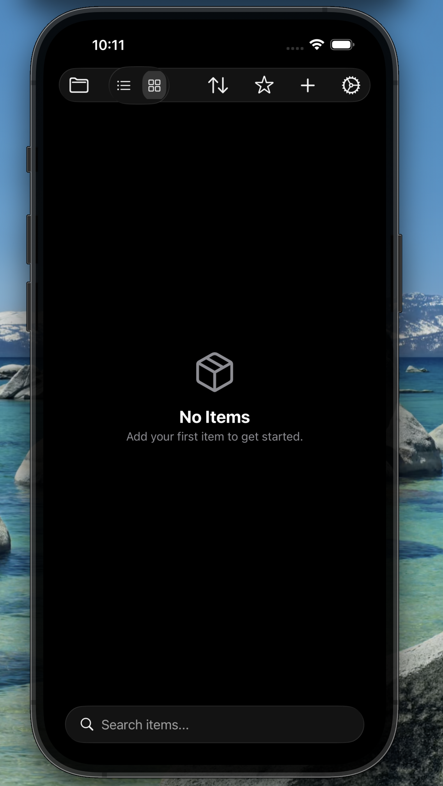
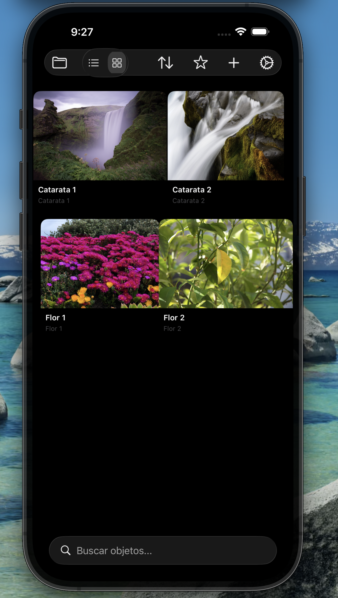
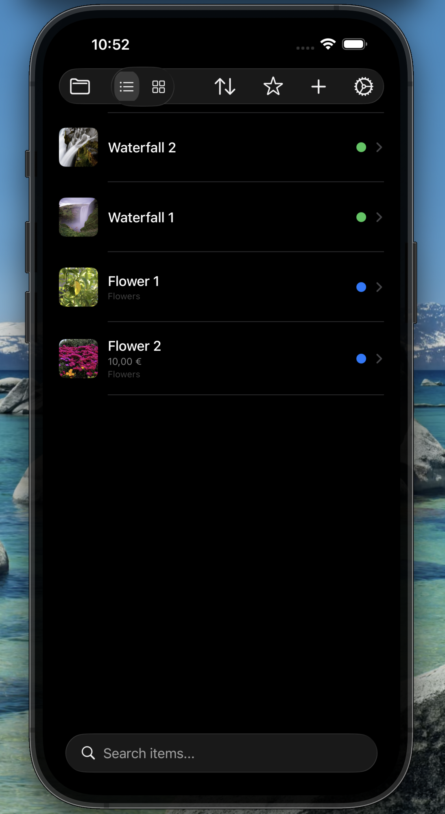
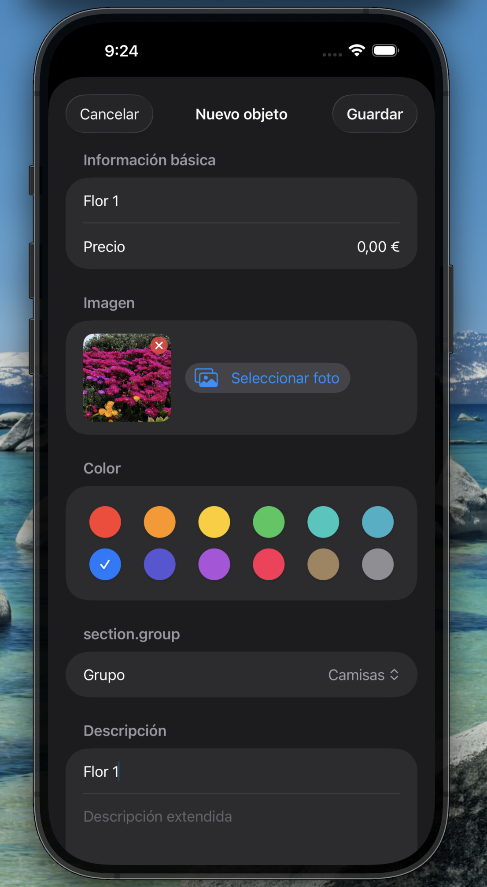
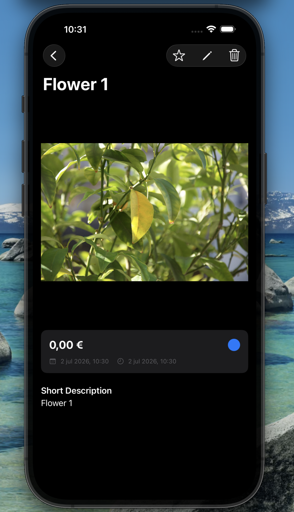
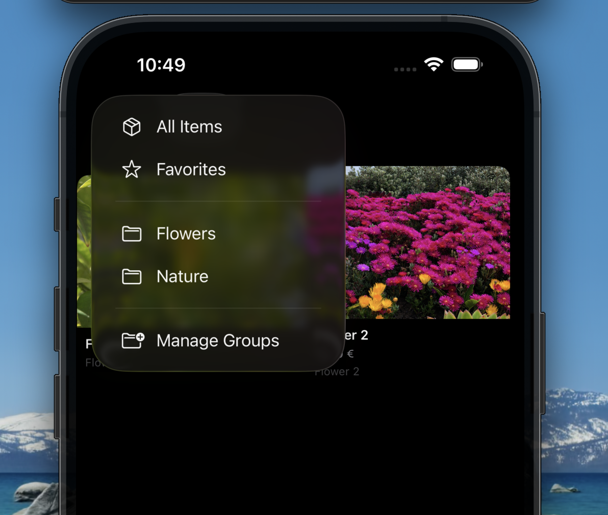
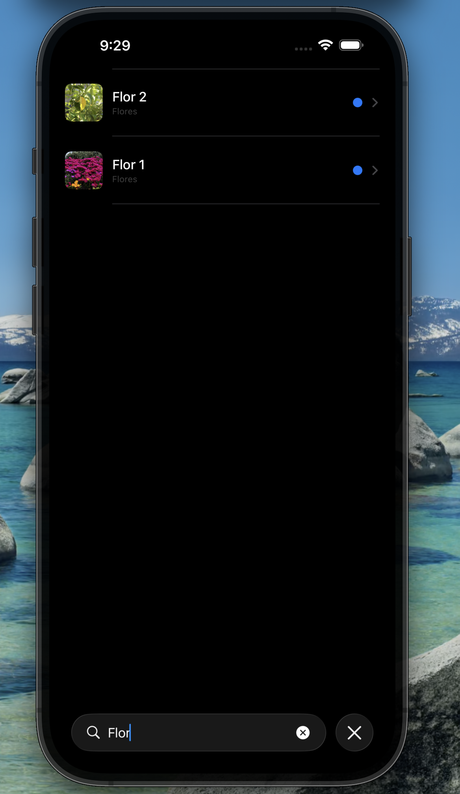
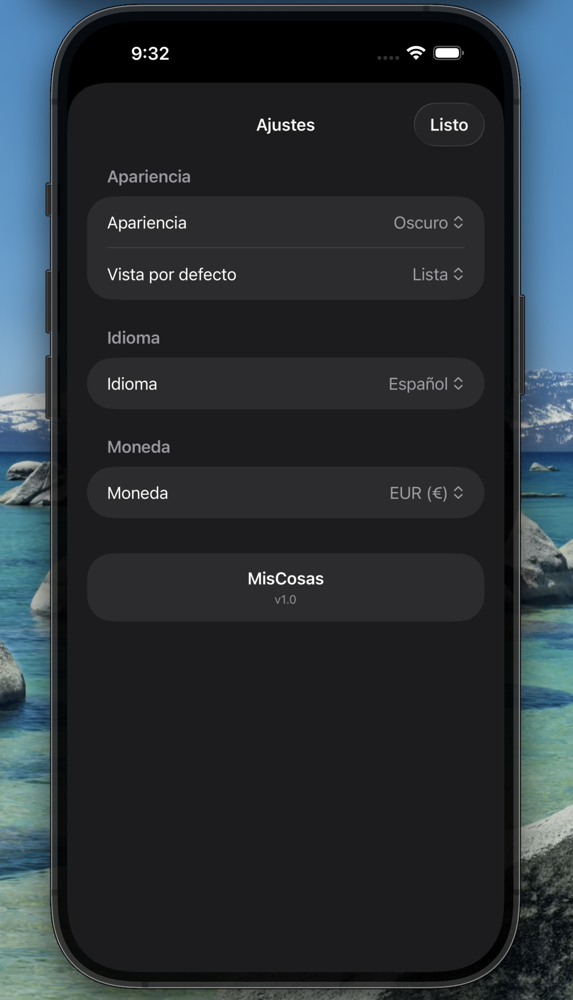
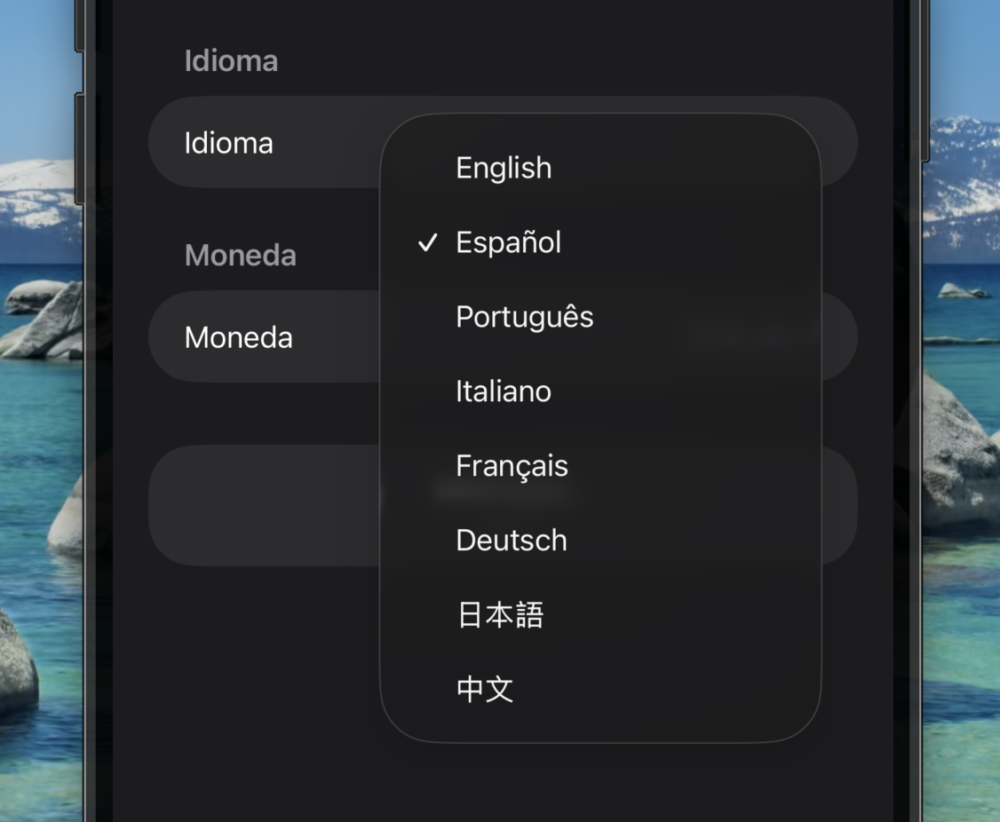
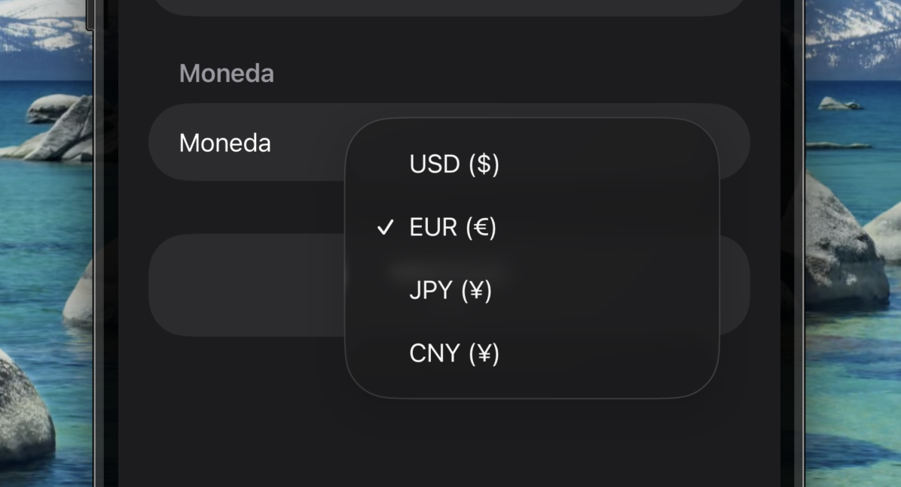

# MisCosas — Benutzerhandbuch

## Inhaltsverzeichnis

1. [Einleitung](#einleitung)
2. [Erste Schritte](#erste-schritte)
3. [Der Hauptbildschirm](#der-hauptbildschirm)
4. [Artikel Verwalten](#artikel-verwalten)
5. [Gruppen Verwalten](#gruppen-verwalten)
6. [Suchen und Filtern](#suchen-und-filtern)
7. [Einstellungen](#einstellungen)
8. [Tipps und Tricks](#tipps-und-tricks)

---

## Einleitung

MisCosas ist eine Inventarverwaltungs-App, die Ihnen hilft, den Überblick über Ihre Besitztümer zu behalten. Sie können Artikel mit Namen, Preisen, Fotos, Beschreibungen hinzufügen und sie in farbcodierten Gruppen organisieren.

**Verfügbar auf:** iPhone, iPad, Mac und Apple Vision Pro.

---

## Erste Schritte

Wenn Sie die App zum ersten Mal öffnen, sehen Sie einen leeren Hauptbildschirm.

Tippen Sie auf die Schaltfläche **+**, um Ihren ersten Artikel hinzuzufügen.

---

## Der Hauptbildschirm

Der Hauptbildschirm zeigt alle Ihre Artikel in der **Listen-** oder **Rasteransicht**.

### Symbolleiste

Die Symbolleiste oben bietet schnellen Zugriff auf alle Funktionen:

| Schaltfläche | Aktion |
|---|---|
| 📁 | Gruppen — nach Gruppe filtern oder Gruppen verwalten |
| ☰/▦ | Zwischen Listen- und Rasteransicht wechseln |
| 🔽 | Sortiermenü — nach Name, Preis oder Datum sortieren |
| ⭐ | Favoritenfilter umschalten |
| ➕ | Neuen Artikel hinzufügen |
| ⚙️ | Einstellungen öffnen |

### Filterleiste

Wenn ein Gruppen- oder Favoritenfilter aktiv ist, erscheint eine Leiste unter der Symbolleiste, die den aktiven Filter mit einer **✕**-Schaltfläche zum Entfernen anzeigt.

---

## Artikel Verwalten

### Einen Artikel Hinzufügen

1. Tippen Sie auf die Schaltfläche **+** in der Symbolleiste.
2. Füllen Sie die Artikeldetails aus:
   - **Name** (erforderlich)
   - **Preis**
   - **Bild** — tippen Sie, um ein Foto aus Ihrer Bibliothek auszuwählen
   - **Farbe** — wählen Sie ein Farbetikett
   - **Gruppe** — einem bestehenden Gruppe zuweisen
   - **Kurzbeschreibung**
   - **Langbeschreibung**
3. Tippen Sie auf **Speichern**.

### Artikeldetails Anzeigen

Tippen Sie auf einen beliebigen Artikel in der Liste oder Rasteransicht, um die vollständigen Details anzuzeigen.

Der Detailbildschirm zeigt:
- Bild in voller Größe
- Preis
- Gruppenname
- Erstellungs- und Änderungsdatum
- Beschreibungen

### Einen Artikel Bearbeiten

1. Öffnen Sie die Artikeldetailansicht.
2. Tippen Sie auf das **Stift**-Symbol in der Symbolleiste.
3. Ändern Sie die Felder.
4. Tippen Sie auf **Speichern**.

### Einen Artikel Löschen

- **Auf iPhone/iPad:** Wischen Sie auf dem Artikel in der Listenansicht nach links und tippen Sie auf **Löschen**.
- **Auf Mac:** Klicken Sie mit der rechten Maustaste auf den Artikel und wählen Sie **Löschen**.

### Einen Artikel Duplizieren

- **Auf iPhone/iPad:** Wischen Sie auf dem Artikel nach links und tippen Sie auf **Duplizieren**.
- **Auf Mac:** Klicken Sie mit der rechten Maustaste auf den Artikel und wählen Sie **Duplizieren**.

---

## Gruppen Verwalten

Gruppen helfen Ihnen, Ihre Artikel in Kategorien zu organisieren.

### Eine Gruppe Erstellen

1. Tippen Sie auf die Schaltfläche **📁** in der Symbolleiste.
2. Wählen Sie **Gruppen Verwalten**.
3. Tippen Sie auf die Schaltfläche **+** in der oberen rechten Ecke.
4. Geben Sie einen Namen ein und tippen Sie auf **Speichern**.

### Eine Gruppe Umbenennen

1. Gehen Sie zu **Gruppen Verwalten**.
2. Tippen Sie auf die Gruppe, die Sie umbenennen möchten.
3. Bearbeiten Sie den Namen und tippen Sie auf **Speichern**.

### Eine Gruppe Löschen

1. Gehen Sie zu **Gruppen Verwalten**.
2. Wischen Sie auf der Gruppe nach links und tippen Sie auf **Löschen**.

> **Hinweis:** Das Löschen einer Gruppe löscht **nicht** die darin enthaltenen Artikel. Die Artikel werden nicht gruppiert.

### Nach Gruppe Filtern

Tippen Sie auf die Schaltfläche **📁** in der Symbolleiste und wählen Sie eine Gruppe aus dem Menü. Es werden nur die Artikel dieser Gruppe angezeigt.

---

## Suchen und Filtern

### Suche

Ziehen Sie die Artikelliste nach unten, um die Suchleiste anzuzeigen. Geben Sie Text ein, um Artikel nach Namen zu filtern.

### Favoriten

Tippen Sie auf die Schaltfläche **⭐** in der Symbolleiste, um nur Ihre favorisierten Artikel anzuzeigen. Tippen Sie erneut, um alle Artikel anzuzeigen.

### Sortieren

Tippen Sie auf die Schaltfläche **🔽**, um Artikel zu sortieren nach:
- **Name** (A–Z)
- **Preis** (niedrig zu hoch)
- **Datum** (neueste zuerst)

---

## Einstellungen

Öffnen Sie die Einstellungen durch Tippen auf die Schaltfläche **⚙️**.

### Erscheinungsbild

Wählen Sie zwischen **System**, **Hell** oder **Dunkel**.

### Standardansicht

Wählen Sie, ob Artikel standardmäßig in der **Listen-** oder **Rasteransicht** geöffnet werden.

### Anzeigeoptionen

- **Preise Anzeigen** — Preisanzahl ein-/ausschalten
- **Bildgröße** — Miniaturgröße mit einem Schieberegler anpassen

### Sprache

Wählen Sie die App-Sprache aus den verfügbaren Optionen. Die Oberfläche wird sofort aktualisiert.

### Währung

Wählen Sie die Währung für die Preisanzahl und -eingabe.

### Datenverwaltung

- **Daten Wiederherstellen** — Platzhalter für zukünftige Backup-Wiederherstellung

---

## Tipps und Tricks

- **Schnell favorisieren:** Wischen Sie in der Listenansicht auf einem Artikel nach rechts, um den Favoritenstern umzuschalten.
- **Schnelle Gruppenfilterung:** Verwenden Sie das **📁**-Menü in der Symbolleiste anstelle von Gruppen Verwalten für schnelles Filtern.
- **Große Bilder:** Fotos werden automatisch für optimale Speicherung und Synchronisierung skaliert.
- **iPad und Mac:** Die Seitenleiste auf der linken Seite ermöglicht schnelles Wechseln zwischen Gruppen und Favoriten.
- **Vision Pro:** Die App passt sich automatisch an die visionOS-Oberfläche an.
